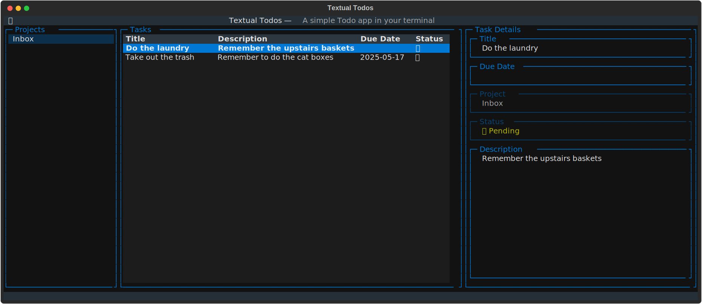

# Textual Todos

A simple todo list app for the terminal built with Textual.

## Features

- Add, remove, and mark tasks as completed
- Include due dates for tasks
- Save and load tasks from a sqlite database

## Todo

- Projects
  - [ ] Add a way to CRUD projects
- Task Details Widget
  - [ ] Make task details widget editable
  - [ ] Add project selection under task details
- Task List
  - [ ] Consider hiding descriptions in task list in favor of due dates
